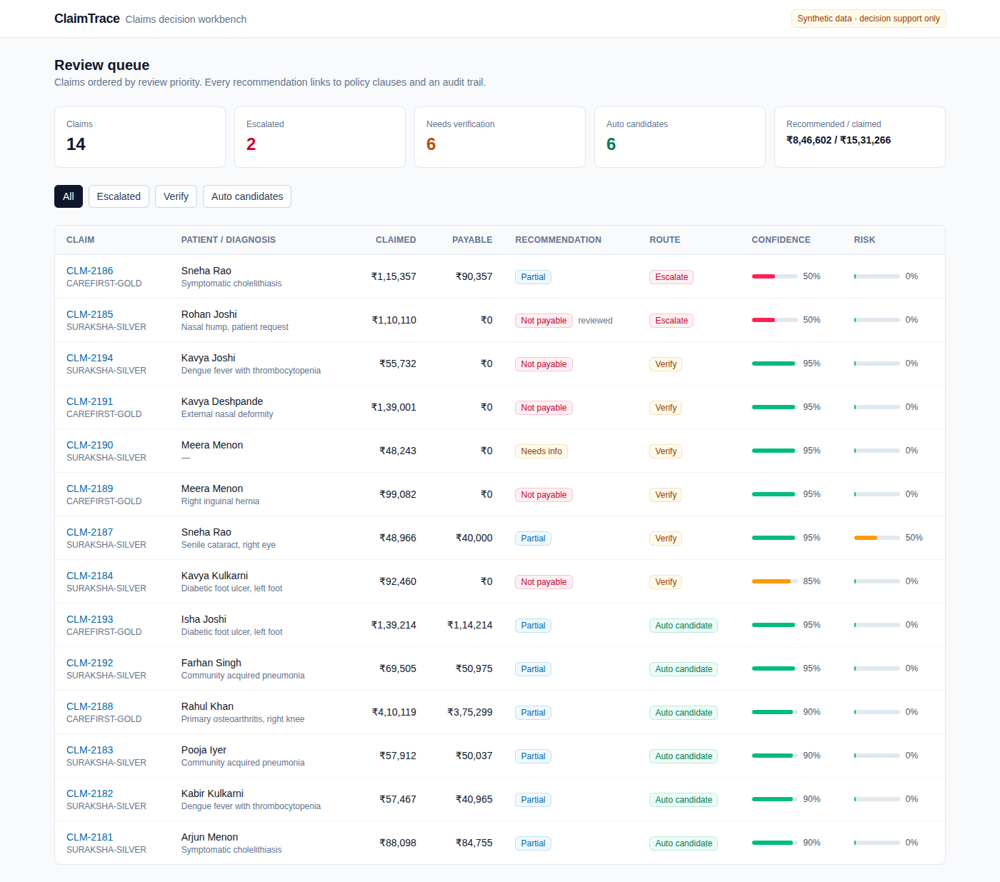
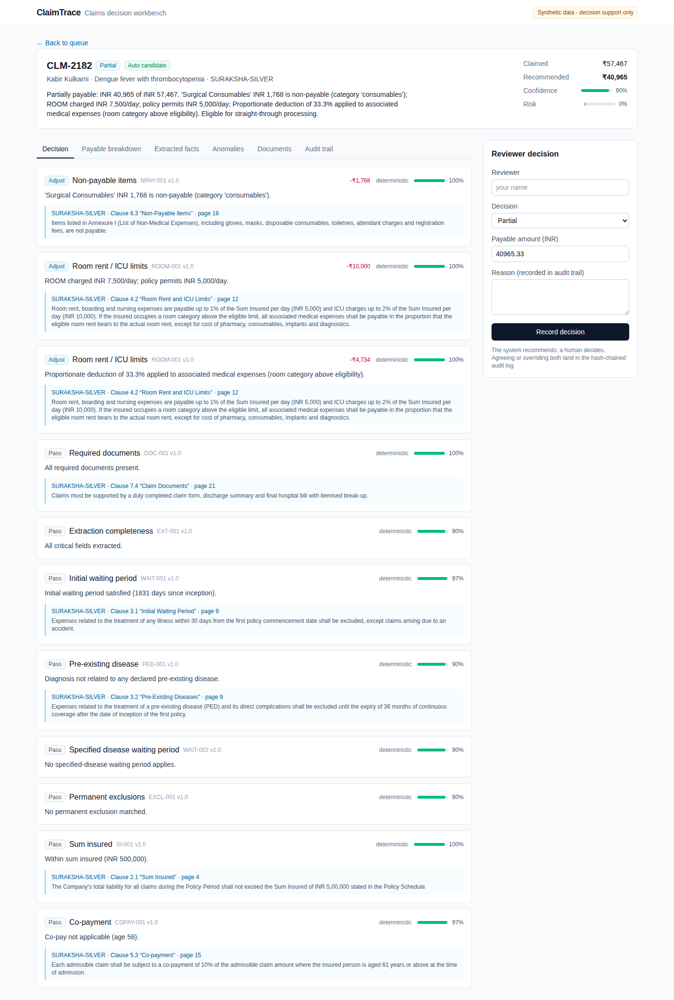
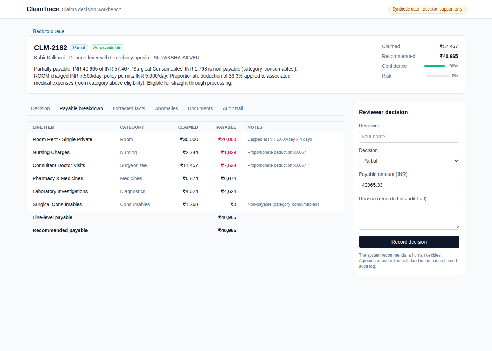
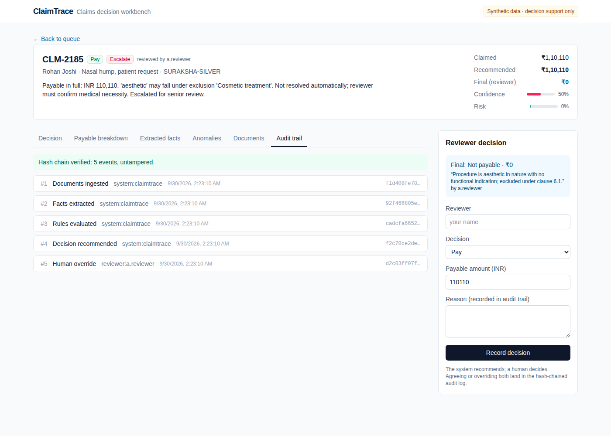
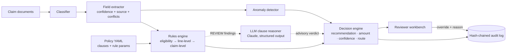

# ClaimTrace

**Evidence-backed decision support for health insurance claims review.**

ClaimTrace takes a health insurance policy and a set of claim documents (claim form, discharge summary, itemised hospital bill) and gives a human reviewer a recommendation: **pay, partially pay, not payable, or needs information**. Each recommendation comes with a payable amount, clause-level policy citations, per-check confidence, anomaly signals, a review route, and a tamper-evident audit trail.

It is a **decision-support workbench, not an auto-adjudicator**. The system recommends and a human decides. Denials and ambiguous cases are never processed straight through.

> **Status: v0.2.** All policies, claims, patients and hospitals are synthetic. v0.2 adds an optional **LLM clause reasoner** (Claude) for the cases the rules can't decide. It is off by default, and the system runs fully without an API key. See [docs/ROADMAP.md](docs/ROADMAP.md).



---

## Why this design

Sending a PDF to an LLM and asking "should this be approved?" produces a demo, not a decision system. Claims adjudication is regulated, money-moving and audited, so ClaimTrace uses a **hybrid architecture**:

| Layer | Approach | Why |
|---|---|---|
| Policy understanding | Policy clauses are compiled into **typed, versioned rule parameters** (YAML → Pydantic), and each one links to its clause and page | Every rupee deducted traces back to specific policy wording |
| Arithmetic and eligibility | **Deterministic rules engine**: waiting periods, PED, exclusions, room-rent proportionate deduction, sublimits, sum insured, deductible, co-pay | Money is never computed by a language model |
| Ambiguity | Conservative matching. An exact keyword match applies a rule. A *related* term (e.g. "aesthetic" vs the cosmetic exclusion) creates a `REVIEW` finding that routes to a human | Deterministic code never guesses at meaning |
| Judgement | Optional **LLM clause reasoner** reads the full policy wording for `REVIEW` findings only and returns a schema-constrained verdict, rationale, quotes and confidence | It *suggests*; it never changes money and never sends a claim straight through (below) |
| Trust | Per-field extraction confidence, cross-document conflict detection, per-finding confidence, anomaly risk score | The confidence policy decides who looks at the claim |
| Accountability | Append-only, **SHA-256 hash-chained** audit log of ingestion, extraction, every rule result, the recommendation and any human override | "Why did we pay ₹40,965 six months ago?" is answerable and verifiable |

### Review routing (a product decision, not a model decision)

| Route | When |
|---|---|
| **Escalate** | any unresolved `REVIEW` finding, confidence < 0.70, or risk ≥ 0.60 |
| **Human verify** | confidence < 0.90, risk ≥ 0.30, **or any denial / missing-info outcome** |
| **Auto candidate** | everything deterministic, high-confidence, low-risk |

Any claim whose recommendation depends on an LLM suggestion is at least **Human verify**. The model can move a claim from "escalate" to "verify", never to straight-through.

---

## LLM clause reasoner (v0.2)

The rules engine can't tell whether *"Aesthetic nasal reshaping"* falls under a cosmetic-surgery exclusion, or whether *"Scar revision and skin grafting for post-burn contracture"* is covered by that exclusion's exception (*"unless for reconstruction following an accident, burn or cancer"*). Before v0.2, both cases were escalated to a senior reviewer with no help.

[`decision/reasoner.py`](backend/claimtrace/decision/reasoner.py) asks Claude one narrow question per ambiguous finding: *does this clause apply to this treatment?*

| Design choice | Detail |
|---|---|
| Narrow scope | Only `REVIEW` findings from yes/no eligibility rules (exclusions, specified-disease waiting periods). Sublimits and every rupee stay deterministic |
| Structured output | JSON-schema-constrained response: `verdict` (applies / does_not_apply / uncertain), `rationale`, `evidence_quotes`, `missing_information`, `confidence` |
| Whole-policy context | The complete policy wording goes in a **prompt-cached** system prompt, so the model sees exceptions and definitions, not just the one clause |
| Prompt-injection hygiene | Hospital document text is wrapped in `<claim_document>` tags and declared untrusted |
| Fail closed | No credentials, API error, refusal, truncation or invalid JSON → no suggestion → the claim stays escalated |
| Confidence gate | A suggestion only affects the recommendation at confidence ≥ 0.80; the deterministic finding stays `REVIEW` in the record |
| Audited | Each suggestion is its own hash-chained audit event with model, prompt version, input SHA-256, tokens and latency |
| Reproducible evals | JSONL response cache keyed by model + prompt version + input hash: the first run costs money, reruns are free and deterministic |
| Refusal fallback | Uses the API's server-side `fallbacks: "default"` |

Enable it with `CLAIMTRACE_LLM_PROVIDER=claude` (plus `ANTHROPIC_API_KEY` or `ant auth login`), or run `make api-llm`. The default model is `claude-opus-5-5` at effort `high`; override with `CLAIMTRACE_LLM_MODEL` / `CLAIMTRACE_LLM_EFFORT`.

---

## Evaluation

`make eval` generates **200 synthetic claims** across 13 scenarios: clean, room-rent over cap, senior co-pay, PED inside and outside its waiting period, specified-disease waiting, initial waiting, cosmetic exclusion, **ambiguous exclusion** (truly excluded), **ambiguous but covered** (a clause exception applies), missing document, conflicting dates across documents, and duplicated bill line. Each claim is rendered into realistic text documents, run through the full pipeline, and compared against ground truth.

### Rules-only baseline

| Metric | Rules only |
|---|---:|
| Extraction field accuracy (8 fields) | **100%** |
| Decision agreement with ground truth | **95.0%** |
| False rejections | **0%** |
| False approvals (raw recommendation) | 5.0% |
| **Unsafe straight-through** (wrong answer routed to auto-processing) | **0%** |
| Escalation recall (cases that require a human) | **100%** |
| Payable amount exact match (±₹1) | 91.7% |
| Citation coverage (adjustments and denials citing a clause) | **100%** |
| Anomaly recall / precision | 100% / 73% |
| Straight-through rate | 51% |

Full report: [docs/eval/eval_report.md](docs/eval/eval_report.md). CI re-runs the benchmark on every push, and the tests fail the build if any safety property regresses.

### With the LLM clause reasoner

`make eval-llm` runs the same 200 claims with Claude enabled. There are 18 ambiguous findings (10 truly excluded, 8 covered by the burn-reconstruction exception). The report adds suggestion accuracy, share of `uncertain` answers, tokens, latency and estimated cost, and is written to `docs/eval/llm/`. The recorded responses land in `docs/eval/llm_cache.jsonl`, so anyone can replay the run for free.

> *Results not yet recorded: this needs a run with Anthropic credentials. The numbers will go here.*

Guard-rails are tested without any API key. [`tests/test_reasoner.py`](backend/tests/test_reasoner.py) covers:
- request shape (model, structured output, cached system prompt with the exception wording, fallbacks)
- fail-closed behaviour on refusal, truncation, API errors and invalid JSON
- the confidence gate
- the audit event
- an **adversarial reasoner** that always answers "does not apply" with confidence 1.0. Across 150 claims it produces **0% unsafe straight-through**, because the model can never bypass human review.

### Failure analysis (rules only)

- **All 10 disagreements are ambiguous exclusions** (e.g. *"Aesthetic nasal reshaping"*). The engine can't resolve these, so it computes an amount and **escalates all of them**. None reach straight-through, but the raw recommendation is wrong. This is the gap the clause reasoner targets. The *ambiguous but covered* cases are right by luck: the rules default to paying, so a reasoner that says "applies" too eagerly would turn them into false rejections. The eval measures both directions.
- **Payable mismatches come from duplicated bill lines.** The anomaly detector flags them (100% recall) and routes them to a reviewer, but deliberately does **not** auto-deduct them. Deciding that a duplicate is an error rather than a legitimate repeat service is a reviewer's call.

### Honest limits of this benchmark

- Ground-truth labels come from an independent reference calculator that works on the generator's ground-truth facts, not on extracted text. So the benchmark measures extraction plus rule application end to end. It does **not** prove that the policy interpretation is correct. That requires human-labelled claims from claims professionals, which is on the roadmap.
- LLM self-reported confidence is not calibrated probability. The 0.80 gate is a starting point, and it only ever moves a claim between two human-review queues.

---

## Screens

| Decision with clause citations | Payable breakdown | Audit trail |
|---|---|---|
|  |  |  |

---

## Architecture



```
backend/claimtrace/
  domain/       Pydantic domain model: Claim, ClaimFacts, Finding, Decision, ...
  policies/     Policy model, registry, versioned policy YAML (clauses + rule params)
  extraction/   Document classifier, heuristic field extractor, LLM extractor interface
  rules/        Deterministic rules engine and conservative condition matching
  decision/     Recommendation + routing policy, LLM clause reasoner (Claude) + response cache
  anomaly/      Explainable anomaly flags + noisy-OR risk score
  audit/        Append-only SHA-256 hash-chained audit log + verification
  claims/       Application service (ingest → extract → adjudicate → override)
  db/           SQLAlchemy models (SQLite default, PostgreSQL via compose), demo seed
  api/          FastAPI routes + request/response schemas
  evaluation/   Synthetic claim generator, reference calculator, metrics harness
backend/tests/  Unit tests per rule, extraction, audit tamper detection, API e2e, eval guard
frontend/       Next.js + TypeScript + Tailwind reviewer workbench
```

### API

| Method | Path | |
|---|---|---|
| `GET` | `/claims` | Review queue |
| `POST` | `/claims` | Submit documents (`{policy_id, documents: [{filename, text}]}`); classifies, extracts and adjudicates |
| `GET` | `/claims/{id}` | Full claim: documents, facts, decision, override |
| `POST` | `/claims/{id}/adjudicate` | Re-run the engine |
| `POST` | `/claims/{id}/override` | Record the reviewer's final decision and reason |
| `GET` | `/claims/{id}/audit` | Audit events + hash-chain verification |
| `GET` | `/policies`, `/policies/{id}` | Policies with clauses and rule parameters |

Interactive docs are served at `http://localhost:8000/docs`.

---

## Run it

**Docker (API + Postgres + UI):**

```bash
docker compose up --build
# UI  http://localhost:3000
# API http://localhost:8000/docs
```

**Local:**

```bash
make setup      # python venv + npm install
make api        # FastAPI on :8000 (SQLite, seeds 14 demo claims)
make web        # Next.js on :3000
make test       # pytest
make eval       # regenerate docs/eval/eval_report.md
make api-llm    # API with the Claude clause reasoner enabled (needs credentials)
make eval-llm   # benchmark with the reasoner; responses cached to docs/eval/llm_cache.jsonl
```

**Stack:** Python 3.11 · FastAPI · Anthropic SDK (Claude) · Pydantic v2 · SQLAlchemy 2 · PostgreSQL/SQLite · Next.js 15 · TypeScript · Tailwind · Docker · GitHub Actions

---

## Disclaimer

ClaimTrace is a research and portfolio project. Policies, insurers, hospitals and patients are fictional. The policy YAML is modelled on the common structure of Indian retail health policies (IRDAI-style waiting periods, room-rent proportionate deduction, co-pay) but is not any insurer's wording. The software is not intended for real claim decisions.
