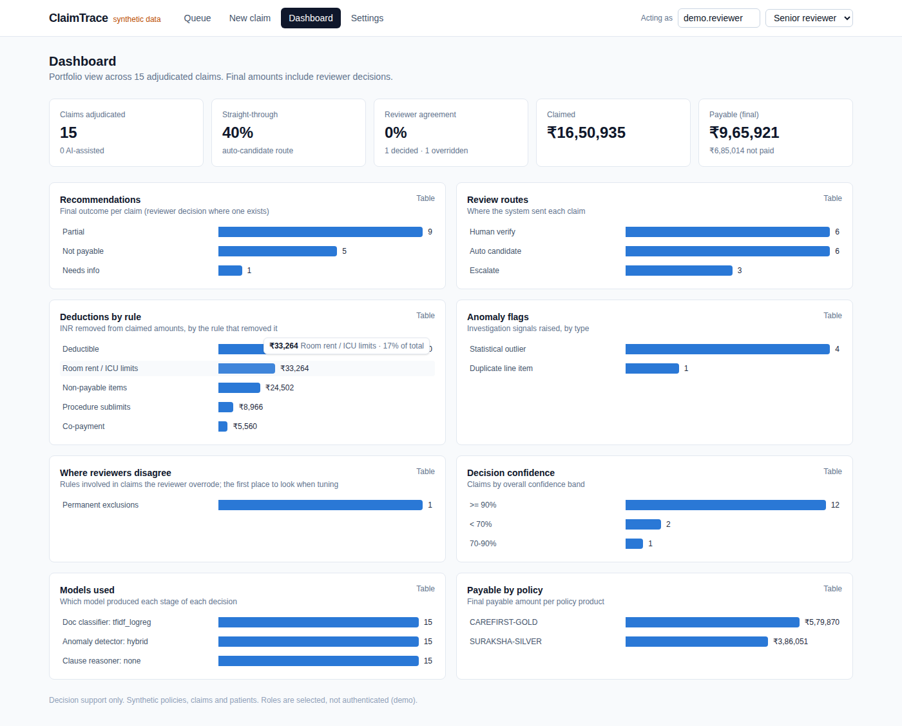
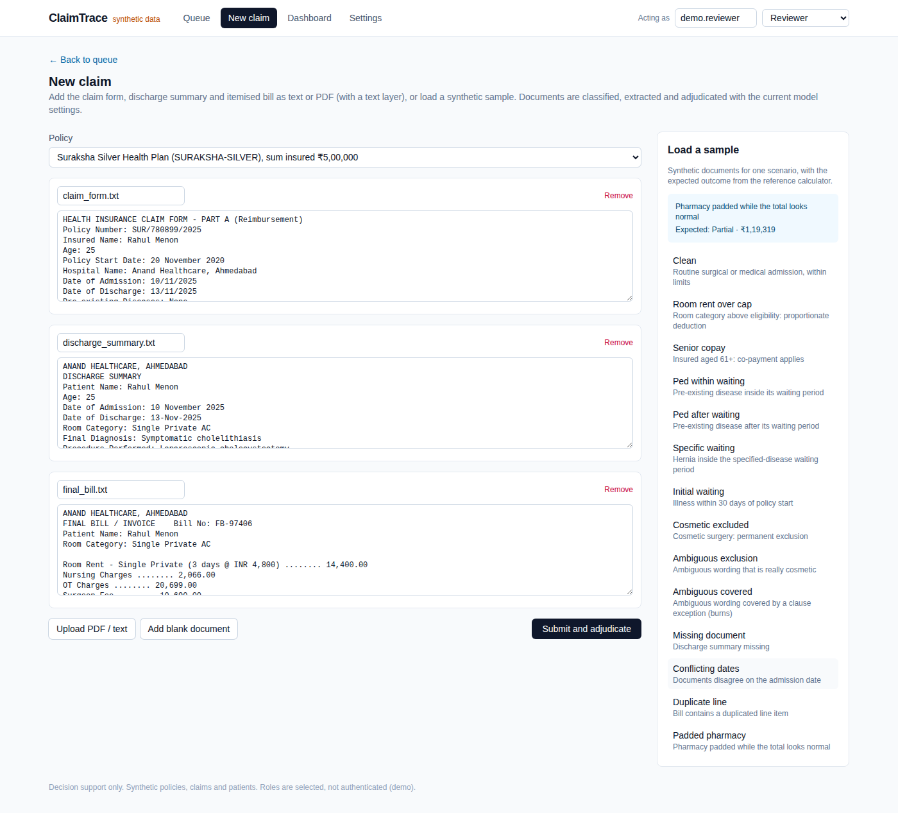
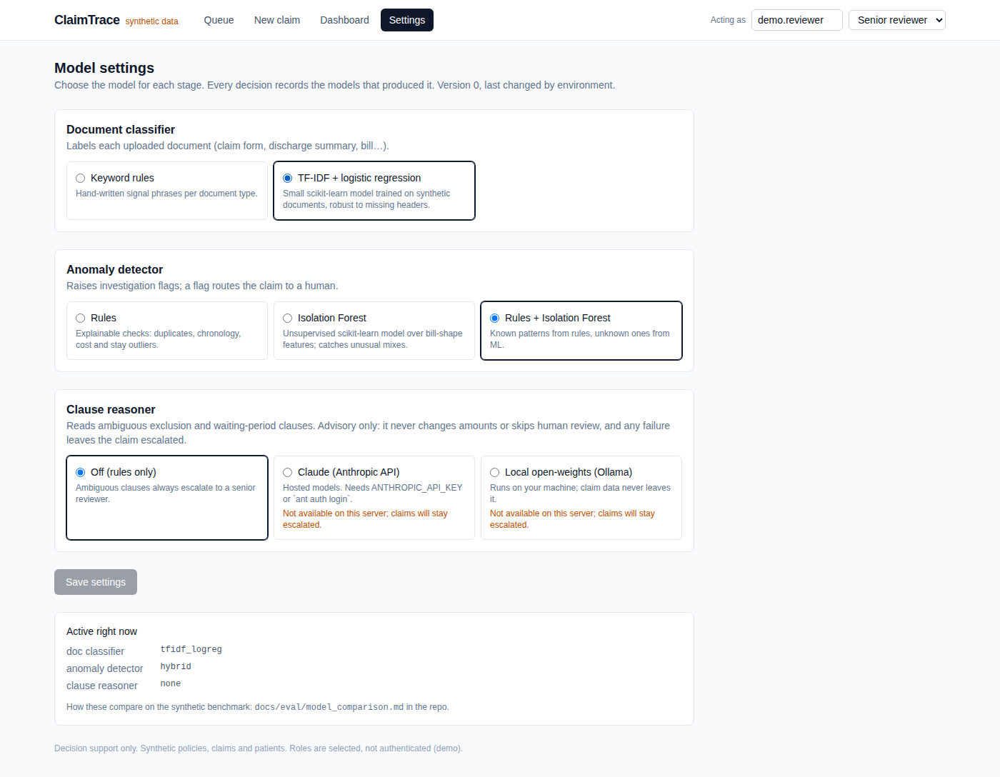
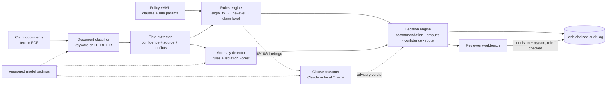

# ClaimTrace

**Evidence-backed decision support for health insurance claims review.**

ClaimTrace takes a health insurance policy and a set of claim documents (claim form, discharge summary, itemised hospital bill) and gives a human reviewer a recommendation: **pay, partially pay, not payable, or needs information**. Each recommendation comes with a payable amount, clause-level policy citations, per-check confidence, anomaly signals, a review route, and a tamper-evident audit trail.

It is a **decision-support workbench, not an auto-adjudicator**. The system recommends and a human decides. Denials and ambiguous cases are never processed straight through.

> **Status: v0.3.** All policies, claims, patients and hospitals are synthetic. The system runs fully without an API key. v0.3 adds:
> - **switchable models**: document classifier, anomaly detector, and a clause reasoner on Claude Haiku/Sonnet/Opus or a **local open-weights model** via Ollama, all benchmarked against each other
> - **roles**: reviewer, senior reviewer and auditor, enforced by the API
> - **claim submission in the UI**: paste text, upload PDFs, or load samples
> - an **analytics dashboard**
>
> See [docs/ROADMAP.md](docs/ROADMAP.md).


---

## Why this design

Sending a PDF to an LLM and asking "should this be approved?" produces a demo, not a decision system. Claims adjudication is regulated, money-moving and audited, so ClaimTrace uses a **hybrid architecture**:

| Layer | Approach | Why |
|---|---|---|
| Policy understanding | Policy clauses are compiled into **typed, versioned rule parameters** (YAML → Pydantic), and each one links to its clause and page | Every rupee deducted traces back to specific policy wording |
| Arithmetic and eligibility | **Deterministic rules engine**: waiting periods, PED, exclusions, room-rent proportionate deduction, sublimits, sum insured, deductible, co-pay | Money is never computed by a language model |
| Ambiguity | Conservative matching. An exact keyword match applies a rule. A *related* term (e.g. "aesthetic" vs the cosmetic exclusion) creates a `REVIEW` finding that routes to a human | Deterministic code never guesses at meaning |
| Judgement | Optional **LLM clause reasoner** reads the full policy wording for `REVIEW` findings only and returns a schema-constrained verdict, rationale, quotes and confidence | It *suggests*; it never changes money and never sends a claim straight through (below) |
| Trust | Per-field extraction confidence, cross-document conflict detection, per-finding confidence, anomaly risk score | The confidence policy decides who looks at the claim |
| Accountability | Append-only, **SHA-256 hash-chained** audit log of ingestion, extraction, every rule result, the recommendation and any human override | "Why did we pay ₹40,965 six months ago?" is answerable and verifiable |

### Review routing (a product decision, not a model decision)

| Route | When |
|---|---|
| **Escalate** | any unresolved `REVIEW` finding, confidence < 0.70, or risk ≥ 0.60 |
| **Human verify** | confidence < 0.90, risk ≥ 0.30, **or any denial / missing-info outcome** |
| **Auto candidate** | everything deterministic, high-confidence, low-risk |

Any claim whose recommendation depends on an LLM suggestion is at least **Human verify**. The model can move a claim from "escalate" to "verify", never to straight-through.

---

## LLM clause reasoner

The rules engine can't tell whether *"Aesthetic nasal reshaping"* falls under a cosmetic-surgery exclusion, or whether *"Scar revision and skin grafting for post-burn contracture"* is covered by that exclusion's exception (*"unless for reconstruction following an accident, burn or cancer"*). Before v0.2, both cases were escalated to a senior reviewer with no help.

[`decision/reasoner.py`](backend/claimtrace/decision/reasoner.py) asks a language model one narrow question per ambiguous finding: *does this clause apply to this treatment?* The model can be **Claude Haiku 4.5, Sonnet 5.5 or Opus 5.5** (Anthropic API), or **any local open-weights model served by Ollama** (e.g. `qwen3:8b`), so claim data never leaves the machine. All providers share one pipeline: the same prompt, cache, schema validation and fail-closed handling.

| Design choice | Detail |
|---|---|
| Narrow scope | Only `REVIEW` findings from yes/no eligibility rules (exclusions, specified-disease waiting periods). Sublimits and every rupee stay deterministic |
| Structured output | JSON-schema-constrained response: `verdict` (applies / does_not_apply / uncertain), `rationale`, `evidence_quotes`, `missing_information`, `confidence` |
| Whole-policy context | The complete policy wording goes in a **prompt-cached** system prompt, so the model sees exceptions and definitions, not just the one clause |
| Prompt-injection hygiene | Hospital document text is wrapped in `<claim_document>` tags and declared untrusted |
| Fail closed | No credentials, API error, refusal, truncation or invalid JSON → no suggestion → the claim stays escalated |
| Confidence gate | A suggestion only affects the recommendation at confidence ≥ 0.80; the deterministic finding stays `REVIEW` in the record |
| Audited | Each suggestion is its own hash-chained audit event with model, prompt version, input SHA-256, tokens and latency |
| Reproducible evals | JSONL response cache keyed by model + prompt version + input hash: the first run costs money, reruns are free and deterministic |
| Refusal fallback | Sonnet/Opus use the API's server-side `fallbacks: "default"` |

Pick the provider and model on the **Settings** page (senior reviewers only), or set `CLAIMTRACE_LLM_PROVIDER=claude|ollama` in the environment. Claude needs `ANTHROPIC_API_KEY` or `ant auth login`. Ollama needs `ollama pull qwen3:8b` on the API host.

---

## Switchable models

Each stage has its own small model, chosen on the Settings page. Settings are **versioned** (who changed what, when), and **every decision records the models that produced it**. The defaults are the best-measured options from [docs/eval/model_comparison.md](docs/eval/model_comparison.md) (`make compare`).

**Document classifiers**, scored on 480 held-out documents across 6 types. "Degraded" means all-caps headers are removed and 30% of lines are dropped, to mimic a poor scan:

| Classifier | Clean | Degraded |
|---|---:|---:|
| Keyword rules (v0.1) | 100% | 85.2% |
| **TF-IDF + logistic regression** (default) | 100% | **99.8%** |

**Anomaly detectors**, run on the 200-claim benchmark. It includes a new *padded pharmacy* scenario: pharmacy is inflated about 4x while fees are trimmed, so the bill total looks normal:

| Detector | Anomaly recall | Precision | Escalation recall | Unsafe straight-through | Straight-through |
|---|---:|---:|---:|---:|---:|
| Rules (v0.1) | 50.0% | 71.4% | 77.6% | 0% | 46.5% |
| Isolation Forest alone | 56.7% | 45.9% | 80.6% | **4.5%** ✗ | 43.5% |
| **Rules + Isolation Forest** (default) | **90.0%** | 54.0% | **95.5%** | **0%** | 38.5% |

What this shows:
- The rules can't see a bill whose *mix* is wrong but whose *total* is normal.
- The Isolation Forest can. It's trained on bill-mix features of normal synthetic claims, and tuned on a separate validation seed. Each flag names its drivers, e.g. *"share_medicines +17.4 sd"*.
- On its own, the model misses duplicate lines and lets wrong amounts through. The hybrid keeps both detectors.
- The price is 8 points less straight-through processing, i.e. more human review. That's a product tradeoff the dashboard makes visible.

**Clause reasoners:** `none`, `claude:claude-haiku-4-5`, `claude:claude-sonnet-5-5`, `claude:claude-opus-5-5`, and `ollama:<model>`. `make compare` scores each on suggestion accuracy, safety metrics, latency and cost, and skips any provider it can't reach instead of silently scoring it as "none". *Results pending a run with credentials or a local Ollama.*

---

## Roles

There's no login yet. The header's role switcher sends `X-User` / `X-Role`, and the **API enforces** the permissions. Adding authentication later only changes where the identity comes from.

| Role | Can |
|---|---|
| Reviewer | Submit claims, re-run adjudication, decide *auto-candidate* and *verify* claims |
| Senior reviewer | Everything above, plus decide **escalated** claims and change **model settings** |
| Auditor | Read-only: queue, claims, audit trails, analytics |

Each audit event records the acting role and user, e.g. `reviewer:rita` submitted and `senior_reviewer:sam` decided.

---

## Evaluation

`make eval` generates **200 synthetic claims** across 14 scenarios:
- clean, room-rent over cap, senior co-pay
- PED inside and outside its waiting period, specified-disease waiting, initial waiting
- cosmetic exclusion, **ambiguous exclusion** (truly excluded), **ambiguous but covered** (a clause exception applies)
- missing document, conflicting dates across documents
- duplicated bill line, **padded pharmacy**

Each claim is rendered into realistic text documents, run through the full pipeline, and compared against ground truth.

### Default stack (TF-IDF classifier + hybrid detector, no LLM)

| Metric | Value |
|---|---:|
| Extraction field accuracy (8 fields) | **100%** |
| Decision agreement with ground truth | **93.5%** |
| False rejections | **0%** |
| False approvals (raw recommendation) | 6.5% |
| **Unsafe straight-through** (wrong answer routed to auto-processing) | **0%** |
| Escalation recall (cases that require a human) | **95.5%** |
| Payable amount exact match (±₹1) | 91.8% |
| Citation coverage (adjustments and denials citing a clause) | **100%** |
| Anomaly recall / precision | 90% / 54% |
| Straight-through rate | 38.5% |

Full report: [docs/eval/eval_report.md](docs/eval/eval_report.md). CI re-runs the benchmark on every push, and the tests fail the build if a safety property regresses.

### With an LLM clause reasoner

`make eval-llm` runs the same claims with Claude enabled. The report adds suggestion accuracy, share of `uncertain` answers, tokens, latency and estimated cost. Responses are cached to `docs/eval/llm_cache.jsonl`, so anyone can replay the run for free.

> *Results not yet recorded: this needs a run with Anthropic credentials or a local Ollama. The numbers will go here.*

Guard-rails are tested without any API key or model server. [`tests/test_reasoner.py`](backend/tests/test_reasoner.py) uses fake clients to cover:
- request shape per model (Haiku has no effort setting or fallbacks; Ollama uses structured output at temperature 0)
- fail-closed behaviour on refusal, truncation, API errors and invalid JSON
- the confidence gate and the audit event
- an **adversarial reasoner** that always answers "does not apply" with confidence 1.0. It leaves the straight-through rate **unchanged** and produces **0% unsafe straight-through**.

### Failure analysis

- **All 13 disagreements are ambiguous exclusions** (e.g. *"Aesthetic nasal reshaping"*). The rules can't resolve these, so they're **all escalated**. The raw recommendation is wrong but never reaches straight-through; this is the gap the clause reasoner targets. The *ambiguous but covered* cases are right only because the rules default to paying, so an over-eager reasoner would show up here as false rejections.
- **3 of 16 padded-pharmacy claims still go straight through** even with the hybrid detector. That's the escalation-recall gap (95.5%). The amounts are correct under the policy, but these are the claims an investigator would want to see.
- **Payable mismatches come from duplicated bill lines.** They're flagged and routed to a reviewer, but deliberately **not** auto-deducted, because deciding that a duplicate is an error is a reviewer's call.

### Honest limits of this benchmark

- Ground-truth labels come from an independent reference calculator that works on the generator's ground-truth facts, not on extracted text. So the benchmark measures extraction plus rule application end to end. It does **not** prove that the policy interpretation is correct. That requires human-labelled claims from claims professionals, which is on the roadmap.
- The small models are trained and tested on synthetic documents and bills (on different seeds). Real scans and real billing patterns will be harder.
- LLM self-reported confidence is not calibrated probability. The 0.80 gate only ever moves a claim between two human-review queues.

---

## Screens

| Decision with clause citations | Payable breakdown | Audit trail |
|---|---|---|
|  |  |  |

| Dashboard | New claim (paste, upload PDF, or sample) | Model settings |
|---|---|---|
|  |  |  |

---

## Architecture



```
backend/claimtrace/
  domain/       Pydantic domain model: Claim, ClaimFacts, Finding, Decision, ...
  policies/     Policy model, registry, versioned policy YAML (clauses + rule params)
  extraction/   Document classifier, heuristic field extractor, LLM extractor interface
  rules/        Deterministic rules engine and conservative condition matching
  decision/     Recommendation + routing policy; clause reasoner (Claude / Ollama) + response cache
  anomaly/      Explainable anomaly rules + noisy-OR risk score
  ml/           Small models: TF-IDF doc classifier, Isolation Forest detector, training data
  settings/     Versioned model settings + component builder + model catalog
  analytics/    Portfolio metrics for the dashboard
  access.py     Roles and permissions
  audit/        Append-only SHA-256 hash-chained audit log + verification
  claims/       Application service (ingest → extract → adjudicate → override)
  db/           SQLAlchemy models (SQLite default, PostgreSQL via compose), demo seed
  api/          FastAPI routes + request/response schemas
  evaluation/   Synthetic generator, reference calculator, benchmark, model comparison
backend/tests/  Unit tests per rule, extraction, audit tamper detection, API e2e, eval guard
frontend/       Next.js + TypeScript + Tailwind reviewer workbench
```

### API

| Method | Path | |
|---|---|---|
| `GET` | `/claims` | Review queue |
| `POST` | `/claims` | Submit documents (`{policy_id, documents: [{filename, text}]}`); classifies, extracts and adjudicates |
| `GET` | `/claims/{id}` | Full claim: documents, facts, decision, override |
| `POST` | `/claims/{id}/adjudicate` | Re-run the engine |
| `POST` | `/claims/{id}/override` | Record the reviewer's final decision and reason |
| `GET` | `/claims/{id}/audit` | Audit events + hash-chain verification |
| `GET` | `/policies`, `/policies/{id}` | Policies with clauses and rule parameters |
| `POST` | `/documents/extract` | Upload PDF/text files; returns text and the detected document type |
| `GET` | `/samples`, `/samples/{scenario}` | Synthetic sample claims with their expected outcome |
| `GET` / `PUT` | `/settings` | Model settings, catalog and availability (`PUT`: senior reviewer) |
| `GET` | `/settings/history` | Every settings version and who made it |
| `GET` | `/analytics` | Dashboard metrics |
| `GET` | `/me`, `/roles` | Caller identity, permissions, role catalog |

Write endpoints check the caller's role (`X-User` / `X-Role` headers) and return `403` when it isn't allowed.

Interactive docs are served at `http://localhost:8000/docs`.

---

## Run it

**Docker (API + Postgres + UI):**

```bash
docker compose up --build
# UI  http://localhost:3000
# API http://localhost:8000/docs
```

**Local:**

```bash
make setup      # python venv + npm install
make api        # FastAPI on :8000 (SQLite, seeds 14 demo claims)
make web        # Next.js on :3000
make test       # pytest
make eval       # regenerate docs/eval/eval_report.md
make api-llm    # API with the Claude clause reasoner enabled (needs credentials)
make eval-llm   # benchmark with the reasoner; responses cached to docs/eval/llm_cache.jsonl
make compare    # compare classifiers, detectors and reasoners -> docs/eval/model_comparison.md
```

**Local open-weights model (optional):** install [Ollama](https://ollama.com), run `ollama pull qwen3:8b`, then choose *Local open-weights (Ollama)* on the Settings page as a senior reviewer.

**Stack:** Python 3.11 · FastAPI · scikit-learn · Anthropic SDK (Claude) · Ollama · Pydantic v2 · SQLAlchemy 2 · PostgreSQL/SQLite · Next.js 15 · TypeScript · Tailwind · Docker · GitHub Actions

---

## Disclaimer

ClaimTrace is a research and portfolio project. Policies, insurers, hospitals and patients are fictional. The policy YAML is modelled on the common structure of Indian retail health policies (IRDAI-style waiting periods, room-rent proportionate deduction, co-pay) but is not any insurer's wording. The software is not intended for real claim decisions.
