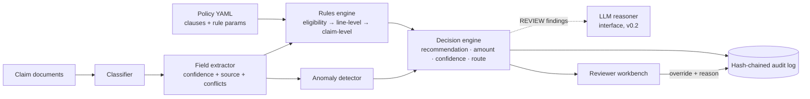

# ClaimTrace

**Evidence-backed decision support for health insurance claims review.**

ClaimTrace takes a health insurance policy and a set of claim documents (claim form, discharge summary, itemised hospital bill) and gives a human reviewer a recommendation: **pay, partially pay, not payable, or needs information**. Each recommendation comes with a payable amount, clause-level policy citations, per-check confidence, anomaly signals, a review route, and a tamper-evident audit trail.

It is a **decision-support workbench, not an auto-adjudicator**. The system recommends and a human decides. Denials and ambiguous cases are never processed straight through.

> **Status: v0.1.** All policies, claims, patients and hospitals are synthetic, and the LLM layer is an interface that is not yet enabled. See [docs/ROADMAP.md](docs/ROADMAP.md).


---

## Why this design

Sending a PDF to an LLM and asking "should this be approved?" produces a demo, not a decision system. Claims adjudication is regulated, money-moving and audited, so ClaimTrace uses a **hybrid architecture**:

| Layer | Approach | Why |
|---|---|---|
| Policy understanding | Policy clauses are compiled into **typed, versioned rule parameters** (YAML → Pydantic), and each one links to its clause and page | Every rupee deducted traces back to specific policy wording |
| Arithmetic and eligibility | **Deterministic rules engine**: waiting periods, PED, exclusions, room-rent proportionate deduction, sublimits, sum insured, deductible, co-pay | Money is never computed by a language model |
| Ambiguity | Conservative matching. An exact keyword match applies a rule. A *related* term (e.g. "aesthetic" vs the cosmetic exclusion) creates a `REVIEW` finding that routes to a human | This is the seam where an LLM reasoner plugs in later, and it can only *suggest* |
| Trust | Per-field extraction confidence, cross-document conflict detection, per-finding confidence, anomaly risk score | The confidence policy decides who looks at the claim |
| Accountability | Append-only, **SHA-256 hash-chained** audit log of ingestion, extraction, every rule result, the recommendation and any human override | "Why did we pay ₹40,965 six months ago?" is answerable and verifiable |

### Review routing (a product decision, not a model decision)

| Route | When |
|---|---|
| **Escalate** | any unresolved `REVIEW` finding, confidence < 0.70, or risk ≥ 0.60 |
| **Human verify** | confidence < 0.90, risk ≥ 0.30, **or any denial / missing-info outcome** |
| **Auto candidate** | everything deterministic, high-confidence, low-risk |

---

## Evaluation

`make eval` generates **200 synthetic claims** across 12 scenarios (clean, room-rent over cap, senior co-pay, PED inside and outside its waiting period, specified-disease waiting, initial waiting, cosmetic exclusion, *ambiguous* exclusion, missing document, conflicting dates across documents, duplicated bill line). Each claim is rendered into realistic text documents, run through the full pipeline, and compared against ground truth.

| Metric | v0.1 |
|---|---:|
| Extraction field accuracy (8 fields) | **100%** |
| Decision agreement with ground truth | **93.5%** |
| False rejections | **0%** |
| False approvals (raw recommendation) | 6.5% |
| **Unsafe straight-through** (wrong answer routed to auto-processing) | **0%** |
| Escalation recall (cases that require a human) | **100%** |
| Payable amount exact match (±₹1) | 91.6% |
| Citation coverage (adjustments and denials citing a clause) | **100%** |
| Anomaly recall / precision | 100% / 80% |
| Straight-through rate | 53% |

Full report: [docs/eval/eval_report.md](docs/eval/eval_report.md). CI re-runs the benchmark on every push, and `tests/test_evaluation.py` fails the build if any safety property regresses.

### Failure analysis

- **All 13 disagreements are ambiguous exclusions** (e.g. *"Aesthetic nasal reshaping"* under a cosmetic-surgery exclusion). The deterministic engine cannot resolve these, so it computes an amount and **escalates all 13**. None reach straight-through, but the raw recommendation is wrong. This is exactly where an LLM clause reasoner (with the policy clause and diagnosis as context, and its output audited) should add value. That is the v0.2 hypothesis, and this benchmark will measure it.
- **Payable mismatches come from duplicated bill lines.** The anomaly detector flags them (100% recall) and routes them to a reviewer, but deliberately does **not** auto-deduct them. Deciding that a duplicate is an error rather than a legitimate repeat service is a reviewer's call.

### Honest limits of this benchmark

Ground-truth labels come from an independent reference calculator that works on the generator's ground-truth facts, not on extracted text. So the benchmark measures extraction plus rule application end to end. It does **not** prove that the policy interpretation is correct. That requires human-labelled claims from claims professionals, which is on the roadmap.

---

## Screens

| Decision with clause citations | Payable breakdown | Audit trail |
|---|---|---|
|  |  |  |

---

## Architecture



```
backend/claimtrace/
  domain/       Pydantic domain model: Claim, ClaimFacts, Finding, Decision, ...
  policies/     Policy model, registry, versioned policy YAML (clauses + rule params)
  extraction/   Document classifier, heuristic field extractor, LLM extractor interface
  rules/        Deterministic rules engine and conservative condition matching
  decision/     Recommendation + routing policy, LLM reasoner interface
  anomaly/      Explainable anomaly flags + noisy-OR risk score
  audit/        Append-only SHA-256 hash-chained audit log + verification
  claims/       Application service (ingest → extract → adjudicate → override)
  db/           SQLAlchemy models (SQLite default, PostgreSQL via compose), demo seed
  api/          FastAPI routes + request/response schemas
  evaluation/   Synthetic claim generator, reference calculator, metrics harness
backend/tests/  Unit tests per rule, extraction, audit tamper detection, API e2e, eval guard
frontend/       Next.js + TypeScript + Tailwind reviewer workbench
```

### API

| Method | Path | |
|---|---|---|
| `GET` | `/claims` | Review queue |
| `POST` | `/claims` | Submit documents (`{policy_id, documents: [{filename, text}]}`); classifies, extracts and adjudicates |
| `GET` | `/claims/{id}` | Full claim: documents, facts, decision, override |
| `POST` | `/claims/{id}/adjudicate` | Re-run the engine |
| `POST` | `/claims/{id}/override` | Record the reviewer's final decision and reason |
| `GET` | `/claims/{id}/audit` | Audit events + hash-chain verification |
| `GET` | `/policies`, `/policies/{id}` | Policies with clauses and rule parameters |

Interactive docs are served at `http://localhost:8000/docs`.

---

## Run it

**Docker (API + Postgres + UI):**

```bash
docker compose up --build
# UI  http://localhost:3000
# API http://localhost:8000/docs
```

**Local:**

```bash
make setup      # python venv + npm install
make api        # FastAPI on :8000 (SQLite, seeds 14 demo claims)
make web        # Next.js on :3000
make test       # pytest
make eval       # regenerate docs/eval/eval_report.md
```

**Stack:** Python 3.11 · FastAPI · Pydantic v2 · SQLAlchemy 2 · PostgreSQL/SQLite · Next.js 15 · TypeScript · Tailwind · Docker · GitHub Actions

---

## Disclaimer

ClaimTrace is a research and portfolio project. Policies, insurers, hospitals and patients are fictional. The policy YAML is modelled on the common structure of Indian retail health policies (IRDAI-style waiting periods, room-rent proportionate deduction, co-pay) but is not any insurer's wording. The software is not intended for real claim decisions.
